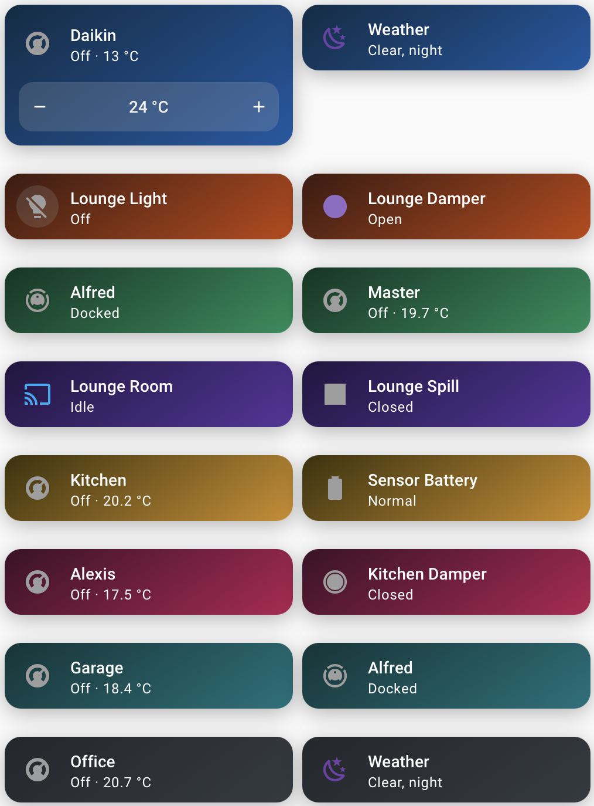
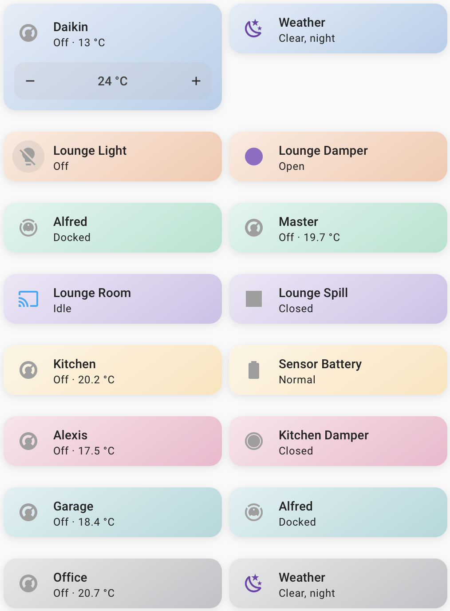

# Gradient Themes

  
  

Gradient (dark) &middot; Pastel - eight of the twenty colours, applied per section to standard tile cards

Home Assistant themes with diagonal gradient card backgrounds in twenty colours, each available in two variants: **Gradient** (dark, rich tones with white text) and **Pastel** (light, soft tones with dark text). Forty themes in total.

Every card gets the gradient background with matched text, icon, slider and toggle colours, no borders and a soft shadow. Colours: Blue, Sky, Cyan, Teal, Emerald, Green, Lime, Gold, Amber, Orange, Red, Crimson, Pink, Magenta, Purple, Violet, Indigo, Midnight, Steel, Slate — as `Gradient <Colour>` (dark) and `Pastel <Colour>` (light). Each theme also exposes the raw gradient as `--card-gradient` for reuse in card-mod or custom cards.

## Installation

1. HACS → menu (⋮) → **Custom repositories** → add `https://github.com/mycrouch/gradient-themes`, category **Theme**.
2. Download **Gradient Themes**, then reload themes (Developer Tools → YAML → Themes) or restart HA.
3. Requires `frontend: themes: !include_dir_merge_named themes` in `configuration.yaml` (already present if you use any HACS theme).

## Usage

Pick a theme per dashboard (dashboard settings), per view (view settings → theme), or globally in your user profile. Themes can also be applied per **section** (section settings) or per **card** where the card supports it - the ecovacs-vacuum-card below has a built-in per-card theme picker. Mixing variants per view works well — e.g. Cool for climate, Slate for utilities.

## The mycrouch card collection

**gradient-themes** provides 40 diagonal-gradient and pastel dashboard backgrounds that pair with the mycrouch Lovelace card collection below — each of those cards also ships its own per-card **theme** picker, so they share one coherent look whether you theme them individually or globally.

| Project | What it is |
| --- | --- |
| [entity-group-card](https://github.com/mycrouch/entity-group-card) | Group any device's entities as a row list or chip grid |
| [pro-v-weather-card](https://github.com/mycrouch/pro-v-weather-card) | Weather-station console — clock, moon, forecast, UV, solar, wind |
| [weather-station-card](https://github.com/mycrouch/weather-station-card) | LCD-console weather station with backlight themes |
| [airtouch-card](https://github.com/mycrouch/airtouch-card) | AirTouch 4/5 AC + zone control |
| [sensibo-thermostat-card](https://github.com/mycrouch/sensibo-thermostat-card) | Sensibo thermostat with mode-coloured backgrounds |
| [ecovacs-vacuum-card](https://github.com/mycrouch/ecovacs-vacuum-card) | Ecovacs/Deebot vacuum with area cleaning |
| **gradient-themes** (this theme set) | 40 gradient + pastel dashboard themes |

## License

MIT
